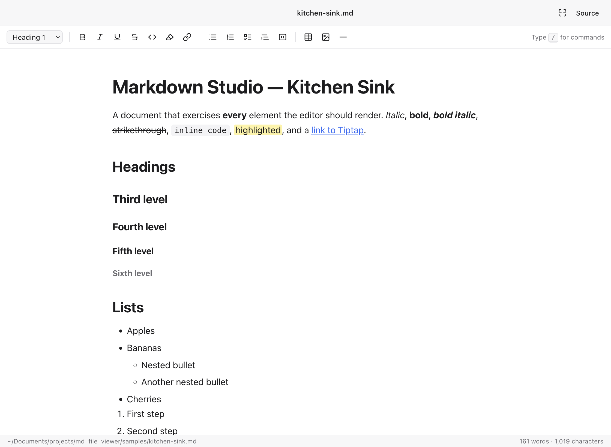
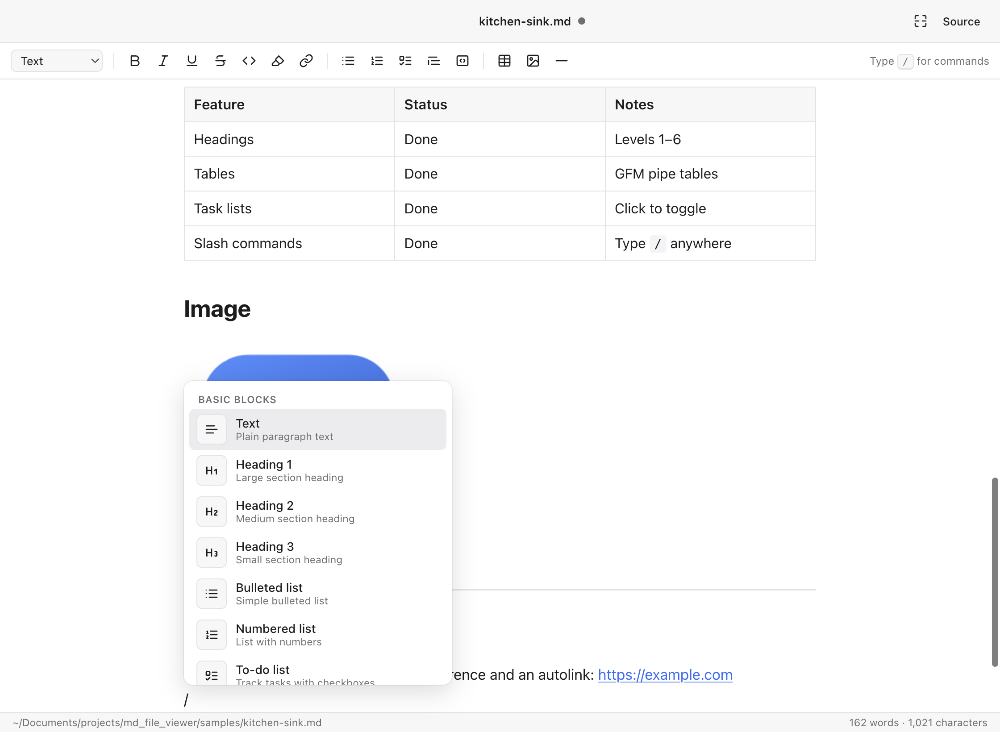

# Markdown Studio

A word-processor style Markdown viewer and editor for macOS. Open any `.md` file, see it fully rendered, edit it in place, and save it back as plain Markdown. Type `/` anywhere to insert blocks Notion-style.



**[Download the latest release](https://github.com/theanandprasad/markdown-studio/releases/latest)** · Free and open source (MIT)

## Features

- Renders every common Markdown element: headings 1–6, bold / italic / underline / strikethrough / inline code / ==highlight==, links, bulleted / numbered / nested lists, task lists with clickable checkboxes, blockquotes, fenced code blocks with syntax highlighting, GFM tables, images (relative paths resolve next to the file), horizontal rules, hard line breaks.
- WYSIWYG editing with a formatting toolbar, a floating bubble menu on selection, and Markdown shortcuts as you type (`# `, `- `, `1. `, `[ ] `, `> `, ` ``` `, `**bold**`, …).
- `/` command menu: Text, Heading 1–3, Bulleted / Numbered / To-do list, Quote, Code block, Divider, Table, Image (from disk or URL), Link, Line break, Date.

  
- New, Open, Save, Save As… with native macOS dialogs. Files are always saved as `.md`.
- Multiple windows, unsaved-changes prompt on close, Open Recent, Reveal in Finder, drag-and-drop `.md` files to open and images to insert.
- "Source" toggle (⇧⌘M) to view and edit the raw Markdown; changes flow both ways.
- Find (⌘F), word/character count, double-click `.md` files in Finder to open them.
- Full width: the title-bar expand button or **View → Full Width** (⌥⌘F) lets the writing area fill the window, Notion-style. Remembered across launches.
- Light and dark mode: follows the system by default, or pick **View → Appearance → System / Light / Dark**. The choice is remembered.

## Download

Grab the latest DMG from the [Releases page](https://github.com/theanandprasad/markdown-studio/releases/latest). One universal build runs on both Apple Silicon and Intel Macs (macOS 13 Ventura or newer).

1. Open the DMG and drag **Markdown Studio** into **Applications**.
2. First launch: the app is free and open source but not signed with an Apple Developer ID, so macOS will block it once. Do one of the following:
   - **macOS 15 Sequoia or newer:** double-click the app, dismiss the warning, then open **System Settings → Privacy & Security**, scroll down, and click **Open Anyway** next to Markdown Studio. Confirm once more.
   - **macOS 13–14:** right-click the app and choose **Open**, then **Open** again.
   - **Any version, via Terminal:**

     ```bash
     xattr -cr "/Applications/Markdown Studio.app"
     ```

   This only happens the first time. The warning goes away permanently once the app is notarized, which needs a paid Apple Developer account.

## Build from source

```bash
npm install
npm run dist:universal   # universal DMG + zip in release/ (what the releases ship)
npm run dist             # separate arm64 and x64 builds
npm start             # build and launch locally
npm run dev           # Vite dev server + Electron with hot reload
npm test              # end-to-end test against the real app
```

`npm run icon` regenerates `build/icon.icns` from `scripts/make-icon.swift`.

## Keyboard shortcuts

| Keys | Action |
| --- | --- |
| ⌘N · ⌘O · ⌘S · ⇧⌘S | New · Open · Save · Save As |
| `/` | Command menu |
| ⌘B · ⌘I · ⌘U · ⇧⌘X | Bold · Italic · Underline · Strikethrough |
| ⌘E · ⇧⌘H · ⌘K | Inline code · Highlight · Link |
| ⌥⌘1…4 · ⌥⌘0 | Heading 1–4 · Plain text |
| ⇧⌘8 · ⇧⌘7 · ⇧⌘9 | Bulleted · Numbered · Task list |
| ⇧⌘B · ⌥⌘C | Quote · Code block |
| ⇧⌘M | Toggle Markdown source |
| ⌥⌘F | Full width |
| ⌘F | Find |
| ⌘-click link | Open in browser |

## Notes on fidelity

Markdown is parsed into a document model and re-serialized on save, so the output is normalized: table columns are re-padded, trailing whitespace is dropped, and bare URLs become explicit links. Content, structure, code fence languages, task states, nested lists, and image paths are preserved. A file is not marked as modified just by opening it.

## Stack

Electron 44 · Vite 8 · Tiptap 3 (ProseMirror) with `@tiptap/markdown` · lowlight for syntax highlighting · electron-builder.

## Layout

```
electron/main.cjs     app lifecycle, windows, menus, file dialogs, save/open IPC
electron/preload.cjs  the small API bridge exposed to the page
src/main.js           app controller: toolbar, source view, find, drag & drop, dirty tracking
src/editor.js         Tiptap setup, slash-command extension, local image resolution
src/slash-menu.js     the "/" command list and popup
src/styles.css        document typography, light/dark themes
tests/e2e.mjs         Playwright-driven end-to-end test
samples/              kitchen-sink.md exercising every element
```
